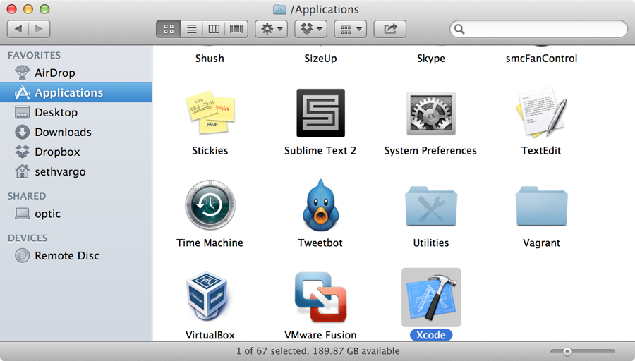
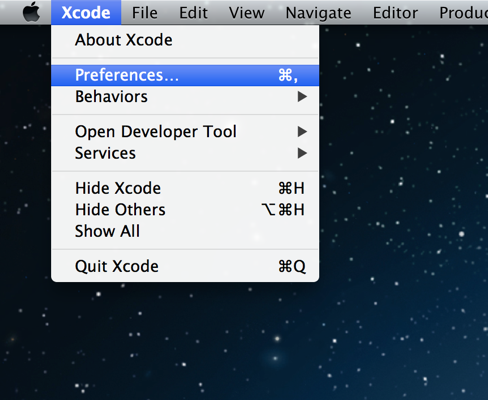
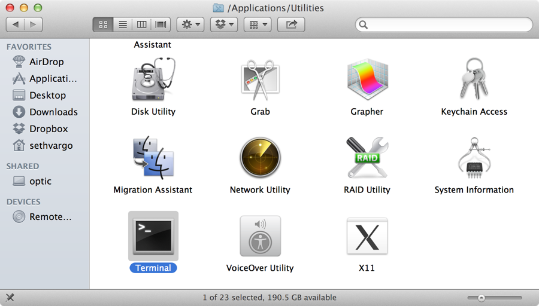
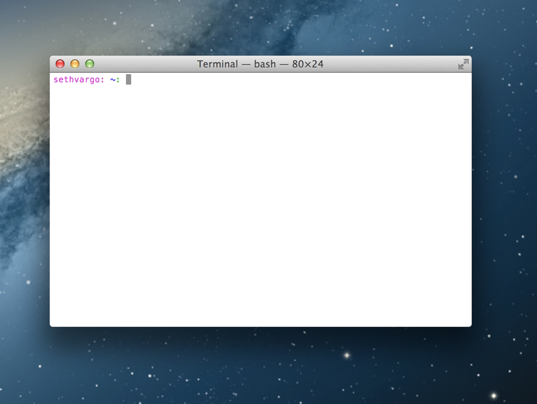

Part 1 - Workstation Setup
==========================
These instructions are for setting up your local workstation on a Macintosh (Apple) computer. If you aren't using a Mac, head over to our [Linux][linux-guide] or [Windows][windows-guide] guide.

This guide will use Vagrant, VirtualBox, rbenv for simplification. If you're familiar with these tools and wish to use alternatives, feel free to do so, but this guide will not extend beyond those tools.

This process may seem complex, but it is a **one-time** setup.

Install Prerequisite Software
-----------------------------
### VirtualBox & Vagrant
1. Install [VirtualBox][virtual-box] and [Vagrant][vagrant] for Mac (accept the default installer options).

    *[Info]* [VirtualBox][virtual-box] is free virtualization software that allows you to run a computer inside your computer. [Vagrant][vagrant] is a command line tool (Terminal) for managing and interacting with virtual machines.

### Xcode
1. Install [Xcode][Xcode] from the AppStore (free)
1. Launch Xcode from the `/Applications` folder:
  
1. Open Xcode Preferences:
  
1. Click "Download" on "Command Line Tools":
  
1. Once the installation has finished, you can quit Xcode.

### Homebrew
Because OSX does not ship with a package manager, you will need to install [homebrew][homebrew]. Don't worry, it's just one command.

1. Open Terminal from `/Applications/Utilities/Terminal` (you may want to add Terminal to your dock)
  
  
1. Install [homebrew][homebrew] by pasting this command in Terminal:

        ruby -e "$(curl -fsSkL raw.github.com/mxcl/homebrew/go)"

### Ruby
Chef runs best on Ruby 1.9 or higher. There are multiple ways to install Ruby on OSX, but for simplicity this guide will use [rbenv][rbenv].

1. Install `git`, `rbenv` and `ruby` (copy-paste into Terminal):

        brew install git && brew update && brew install rbenv ruby-build && echo 'eval "$(rbenv init -)"' >> ~/.bash_profile && source ~/.bash_profile

        rbenv install 1.9.3-p374
        rbenv shell   1.9.3-p374
        rbenv global  1.9.3-p374

        gem update --sytem
        gem install bundler --no-ri --no-rdoc

Rock On!
--------
That's it! Your system is now prepared for Chef. [Continue onto Part 2][part-2].

[linux-guide]: http://not-done-yet "Linux - Chef Workstation Setup QuickStart Guide"
[windows-guide]: http://not-done-yet "Windows - Chef Workstation Setup QuickStart"
[Xcode]: https://itunes.apple.com/us/app/Xcode/id497799835?mt=12 "Download Xcode from the AppStore"
[virtual-box]: http://download.virtualbox.org/virtualbox/4.2.6/VirtualBox-4.2.6-82870-OSX.dmg "VirtualBox for Mac"
[vagrant]: http://files.vagrantup.com/packages/476b19a9e5f499b5d0b9d4aba5c0b16ebe434311/Vagrant.dmg "Vagrant for Mac"
[homebrew]: http://mxcl.github.com/homebrew/ "Homebrew"
[rbenv]: https://github.com/sstephenson/rbenv "rbenv"
[part-2]: ../Part+2+-+Working+with+Chef+Repo "Part 2 - Working with Chef Repo"
